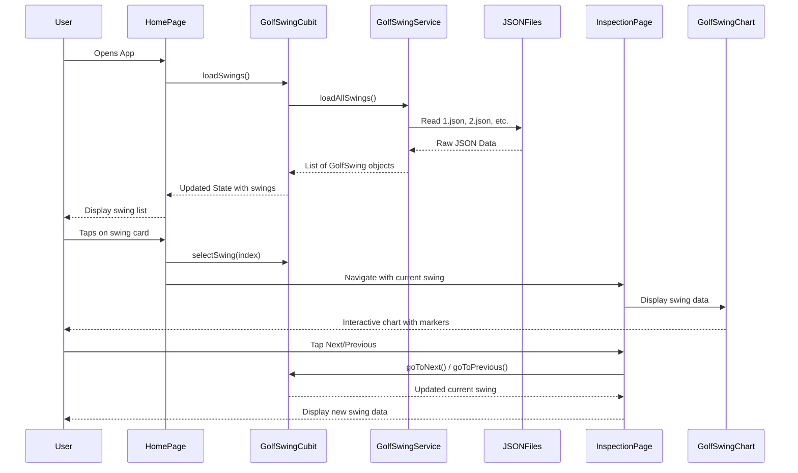

# HackMotion Golf Swing Analyzer

A Flutter application for analyzing golf swing data with interactive charts and timeline visualization. Track key swing metrics including flexion/extension and ulnar/radial movement patterns.

Built with Flutter, Dart, and BLoC pattern for state management.

## Demo Video

https://github.com/user-attachments/assets/78b7e1a0-ee65-48b2-9e62-d0ca2cc8e3ad

## Features

- Interactive swing analysis with smooth charts
- Timeline navigation through swing phases
- Multi-metric tracking (flexion/extension, ulnar/radial)
- Position markers for key swing positions (Address, Top, Impact)
- Seamless navigation between multiple swings

## App Flow



## Project Structure

```
lib/
├── bloc/                 # State management (BLoC pattern)
├── models/               # Data models
├── pages/                # UI screens
├── services/             # Data services
├── theme/                # App styling and colors
└── widgets/              # Reusable UI components

exampleJSONS/             # Sample golf swing data
├── 1.json
├── 2.json
└── ...
```

## Installation

1. **Clone the repository**
   ```bash
   git clone https://github.com/kzars/HackMotion-Golf-Swing-Analyzer.git
   cd HackMotion-Golf-Swing-Analyzer
   ```

2. **Install dependencies**
   ```bash
   flutter pub get
   ```

3. **Run the app**
   ```bash
   flutter run
   ```

## Technologies Used

- **Flutter** - Cross-platform mobile development
- **Dart** - Application logic and UI
- **flutter_bloc** - State management
- **fl_chart** - Interactive data visualization
- **BLoC Pattern** - Architecture for separation of concerns


